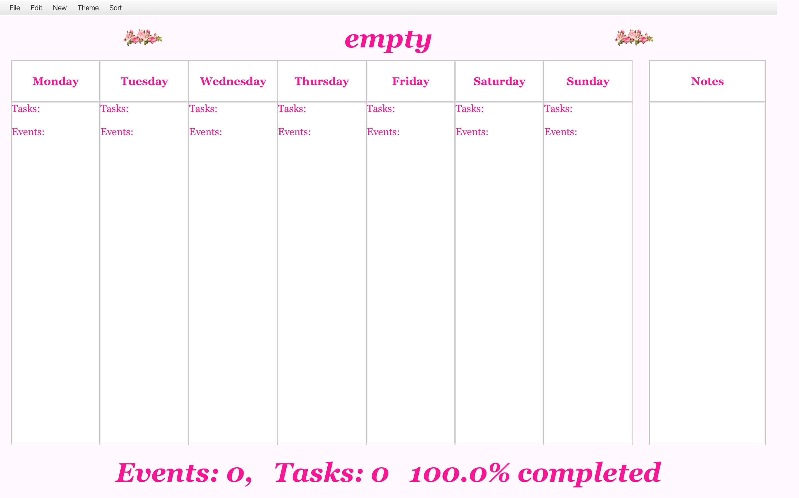
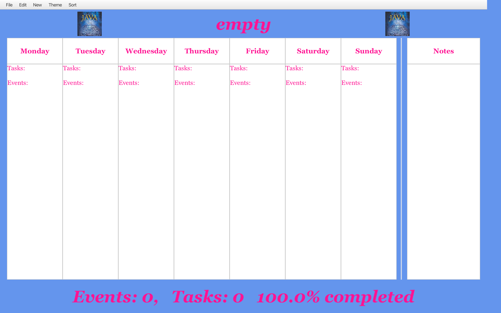
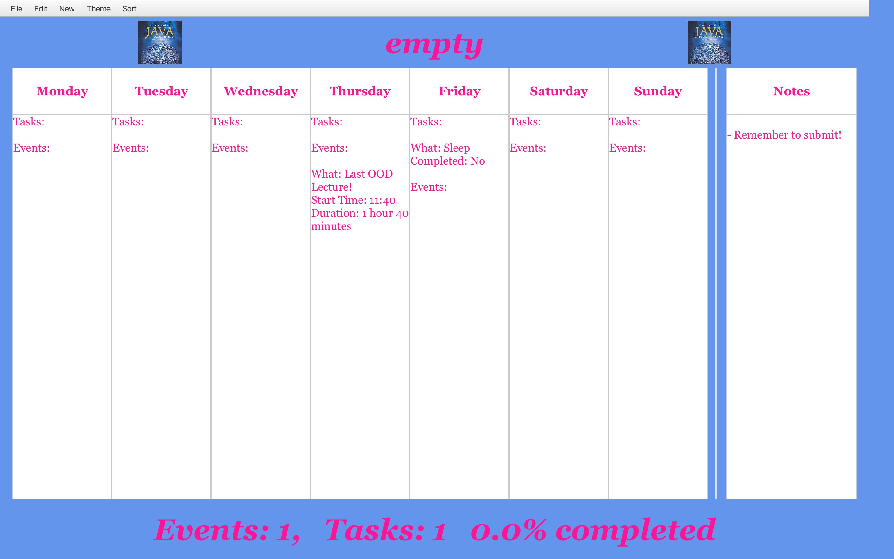

# 3500 PA05 Project Repo

[PA Write Up](https://markefontenot.notion.site/PA-05-8263d28a81a7473d8372c6579abd6481)

- [ ]  A pitch for your program describing each of its features (pretend you’re writing an App Store description);
- Our bullet journal is meant for those who love to create unique designs by keep the information simple to read. By implementing the feature of creating custom themes it allows users to have more individuality for their bullet journal. We also knew that things change as time moves on so we wanted user to be able to edit old items, change the completion and see their process of a week. Finally a week is made even more interesting with the addition of personal notes and quotes that again allow a user to fully personalize their journal 
- [ ]  At least one screenshot showcasing your GUI and its features;
- opening an empty week

- changing the theme of the week

- adding a task, event and note to the week

- [ ]  A descriptive example of how you applied each SOLID principle to your project (1 short paragraph per principle);
- Single Responsibility: One example of single responsilbity was creating classes for every button on action event based on where that button lived, rather than attempting to write endless lambdas we extended the interface and ensured that each button was doing it's correct job in another class.
- Open/Closed: One example of open/closed was our occasion class, both event and task extended occasion based on how they were similar, but the occasion class was not changed at all to fit into what a task and what an event need to do differently
- Liskov: One example of liskov is again our occasion class which was how all tasks and events were object type occasion not the specific type of event or task
- Interface Segregation: One example of interface segregation was having an interface for each of our model, view and controller, rather than attempting to do everything all together we separated it out into what each interface itself should be handling
- Depedency Inversion: One example of dependency inversion was maintaining one view instance rather than creating a new one each time we had to do view methods
- [ ]  A detailed description of how you could extend your program to add an additional, non-implemented Feature from above; and
- One way we could implement feature from above is using the same model and logic however builing new fxmls to incorporate the option of a vertical layout, given that all the information stored and the actions would be handled the same, the only difference is changing the fxml file to be displayed vertically and allowing the user to easily switch back and forth by adding a new item to our menu bar
- [ ]  Attribution for any images utilized in your program
- google.com